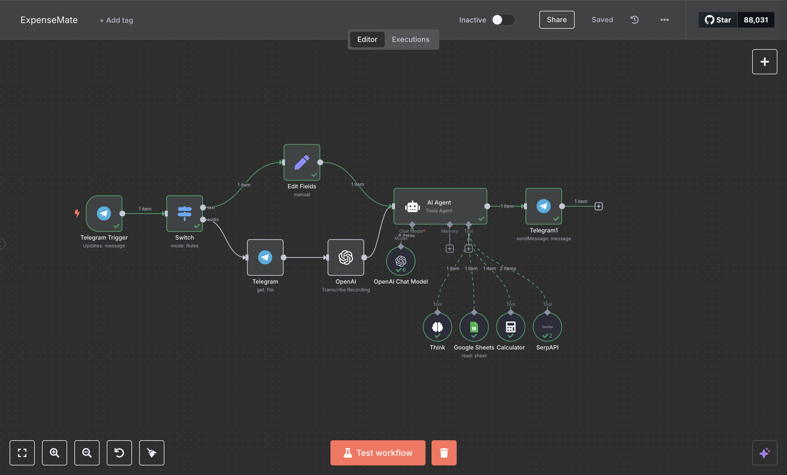
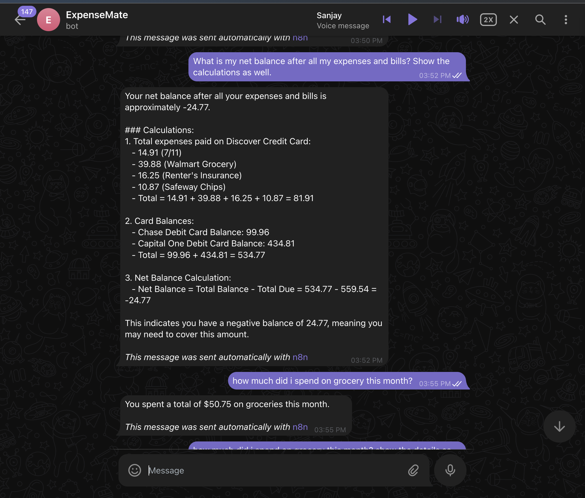
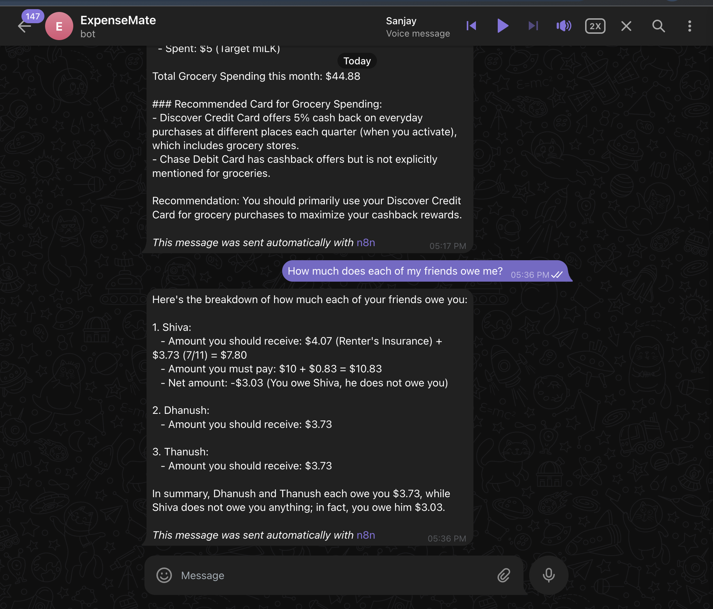
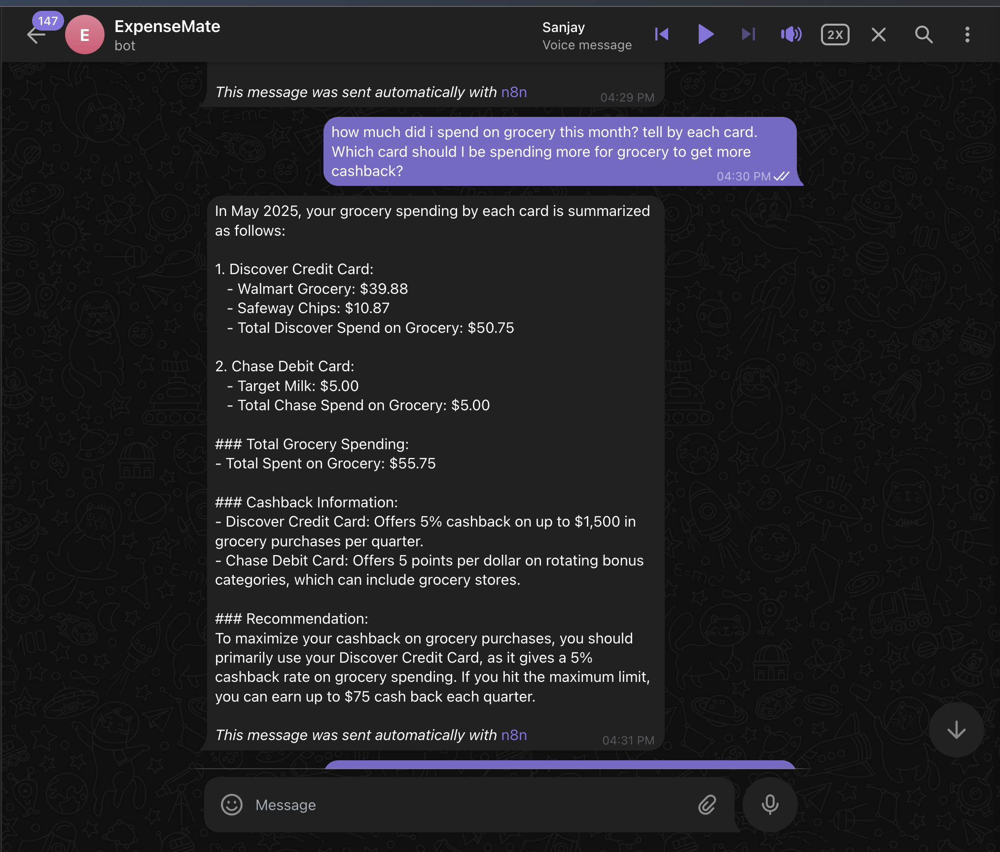
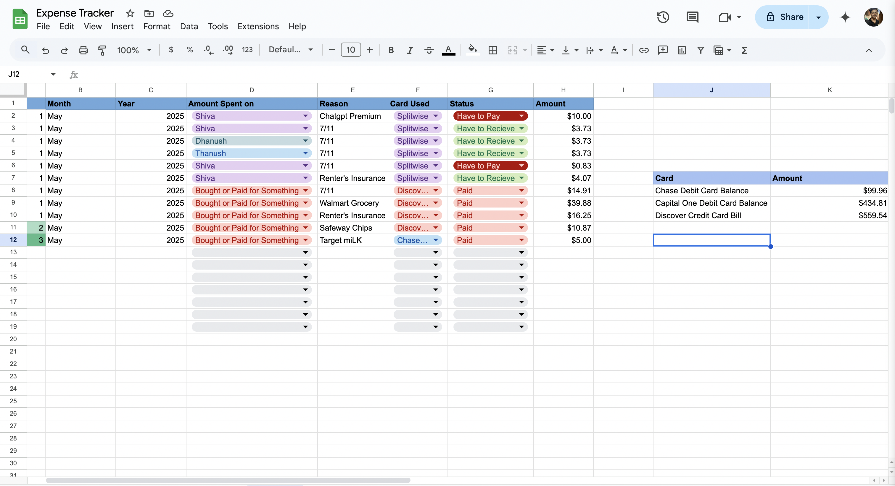

# ExpenseMate: 💰 AI-Powered Expense Manager Agent via Telegram

A smart AI assistant that helps you **track, query, and optimize your expenses** directly from Telegram — powered by [n8n](https://n8n.io), OpenAI's GPT-4, Google Sheets, and memory-enabled tools.

Built especially for **students and roommates** who often split bills, forget shared expenses, or want to maximize credit card rewards.

---

## 🔍 What It Can Do

- Track personal and shared expenses (stored in Google Sheets)
- Answer natural queries like:
  - “How much do I owe Alex?”
  - “What did I spend on groceries this month?”
  - “Which card did I use most?”
- Suggest ways to **optimize card usage** (e.g., cashback on certain cards)
- Works via **Telegram voice or text**

---

## 📸 Workflow Preview

### 🧠 Full n8n Workflow

---

### 💬 Telegram Agent in Action

  
  

---

### 🧾 Google Sheets Template

Use this format to track your expenses. The bot reads from here to answer your questions.

---

## ⚙️ LLM, Tools and Memory for Agent

- 🧠 **OpenAI GPT-4** – natural language understanding and responses
- 🧾 **Google Sheets** – stores all expenses
- 🧮 **Calculator Tool** – for math operations
- 💭 **Think Tool** – for multi-step reasoning
- 🔍 **SerpAPI Tool** – for web-search
- 🧠 **Simple Memory** – retains conversation context (per user)

---

## 🚀 Getting Started

1. Clone this repo
2. Import the workflow JSON into your n8n instance
3. Set up:
   - A Telegram Bot (via BotFather)
   - Google Sheets
   - OpenAI API key
4. Customize your Google Sheet with the template mentioned above.
5. Start chatting with your AI finance assistant on Telegram!

---

## 📌 Notes

- Each user session is stored via their Telegram ID using **Simple Memory**
- You can also extend the bot to support:
  - Budget reminders
  - Expense category limits
  - Group-level summaries

---

## 🙋‍♂️ Why I Built This

As an international student, I often shared expenses with friends — and keeping track of who owes what was a headache. This bot makes it effortless while helping me optimize spending for rewards too.

---

## 📬 Want to Contribute?

Feel free to open issues, suggest features, or fork and build your own version!

---

## 🏷️ Tags

`n8n` `openai` `gpt4` `telegrambot` `google-sheets` `student-life` `fintech` `expense-tracker` `memory-agent`

